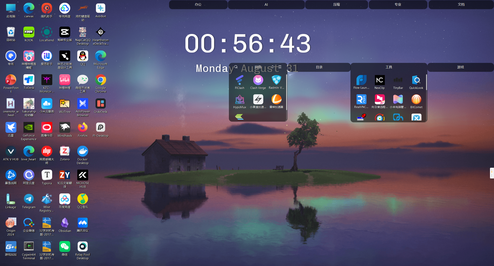
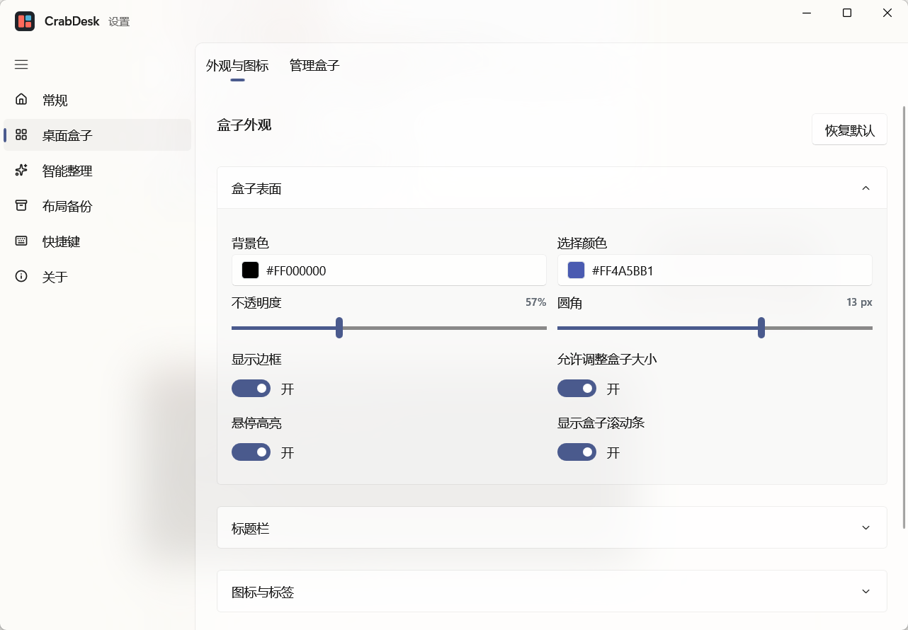
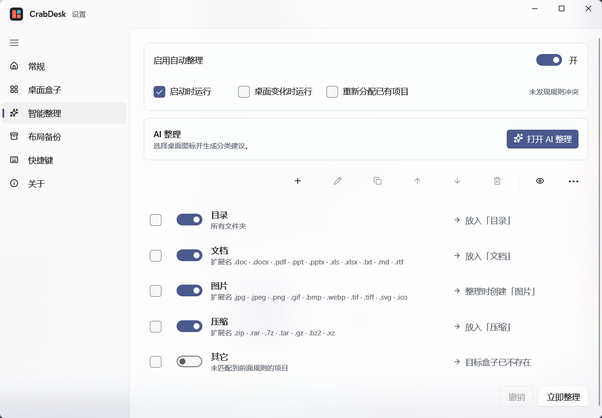
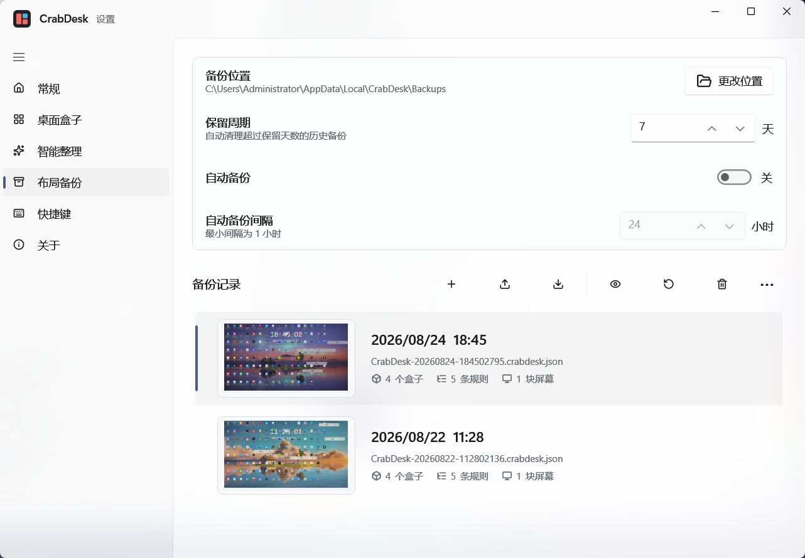
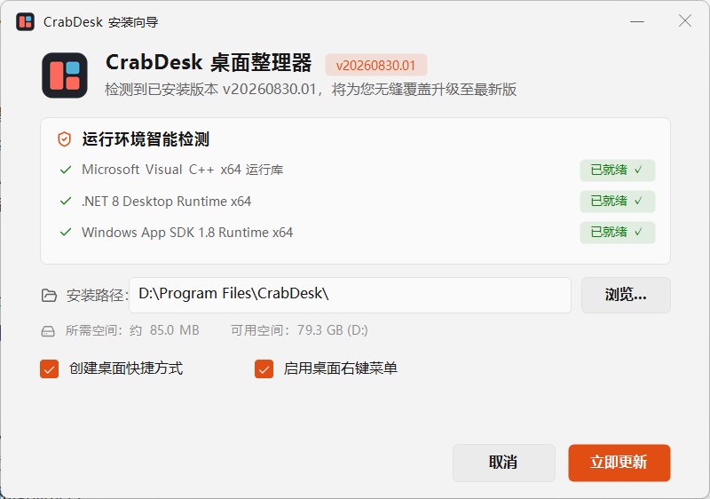

<p align="center">
  
</p>

<h1 align="center">CrabDesk</h1>

<p align="center">
  把杂乱的桌面装进盒子 —— 面向 Windows 10/11 的桌面整理工具
</p>

<p align="center">
  <a href="https://github.com/yixing233/CrabDesk/actions/workflows/ci.yml"></a>
  <a href="https://github.com/yixing233/CrabDesk/releases"></a>
  <a href="LICENSE"></a>
</p>

CrabDesk 是一款开源的 Windows 桌面整理工具：在桌面上创建可自由排列的「盒子」，把文件、文件夹和快捷方式按自己的习惯收纳进去。**文件始终留在原地** —— 拖入盒子只改变逻辑分组，不复制、不移动，也不改变任何路径。

<p align="center">
  
</p>

## ✨ 特性

### 📦 桌面盒子

- 盒子直接嵌入 Explorer 桌面层，不是悬浮置顶窗口，`Win+D` / `Win+M` 后依然可见
- 自由移动、缩放、折叠；标题栏内直接重命名
- 折叠的盒子在鼠标悬停时自动展开，移开后恢复
- 圆角抗锯齿渲染，透明边缘透出壁纸；可配置背景与强调色、35%–100% 不透明度、边框和缩放手柄
- 网格 / 列表两种视图，可调整图标尺寸与间距

<p align="center">
  
</p>

### 🔗 虚拟分组，文件不动

- 拖入盒子只更新逻辑分组，不复制文件、不改变路径
- 分组项的原生图标停放到桌面可视区域外，移出盒子时恢复原位置
- 未分组的项目继续由 Explorer 原生显示和交互，CrabDesk 不重绘代理图标，也不替换桌面右键菜单

### 🧠 自动整理与 AI 分类

- 按类型、扩展名、名称通配符配置整理规则，一键应用到桌面图标
- 规则用紧凑表格编辑，启用状态、匹配模式和目标盒子一目了然
- 可选接入 OpenAI 兼容接口做 AI 分类：自定义标签（自动创建同名盒子）和提示词；**只发送图标名称，不上传图标图片或文件内容**，API Key 保存在本机

<p align="center">
  
</p>

### 📁 映射盒子

- 绑定任意文件夹并实时显示其内容
- 支持只读模式、离线重连状态提示

### 🖥️ 多显示器与桌面兼容

- 多显示器布局、盒子跨屏拖放、DPI 自适应
- 与 Wallpaper Engine 等动态壁纸层级兼容
- Explorer 重启后自动恢复布局和图标位置

### 🎨 主题与外观

- 设置窗口、托盘菜单、盒子均支持浅色 / 深色 / 跟随系统
- 设置窗口可选 Mica / Acrylic 等 Fluent 背景材质

### 💾 备份与恢复

- 手动与每日自动备份，可配置保留策略；导入、导出、一键恢复
- 恢复前自动回滚备份；重置布局前自动备份

<p align="center">
  
</p>

### ⚡ 效率与更新

- 全局快捷键：「显示桌面」「立即整理」，注册冲突实时提示
- 托盘图标、单实例、开机自启
- 通过 GitHub Releases 检查更新（稳定版 / 测试版通道），应用内下载，SHA-256 与 Authenticode 双重校验
- 「关于」页提供桌面宿主、显示器 / DPI 诊断信息，可一键复制

## 📥 安装

**系统要求**：Windows 10 / 11（64 位）

从 [GitHub Releases](https://github.com/yixing233/CrabDesk/releases) 下载：

| 安装包 | 说明 |
| --- | --- |
| `CrabDesk-Setup-x64.exe` | 唯一正式安装包：内嵌 framework-dependent CrabDesk，检测并仅下载缺失的 Microsoft 运行组件 |

Setup 自身采用 Native AOT，不依赖目标电脑预先安装 .NET；CrabDesk 应用本体作为内部 Payload 嵌入 Setup，不会作为第二个 Release 下载资源发布。

每个 Release 都附带 `SHA256SUMS.txt` 校验文件，应用内更新也会在安装前自动校验。

<p align="center">
  
</p>

## 🚀 快速开始

1. 启动 CrabDesk，从托盘菜单或设置页创建一个盒子
2. 把桌面上的文件、文件夹、快捷方式拖进盒子 —— 只是归类，不会移动文件
3. 在「整理规则」页配置规则或启用 AI 分类，一键把桌面整理干净
4. 把常用文件夹添加为映射盒子，随时查看内容

## 🔒 隐私与安全

- CrabDesk 不收集任何使用数据，所有配置仅保存在本机（`%LocalAppData%\CrabDesk`）
- AI 分类只向接口发送图标名称；API Key 本地保存，不上传
- 更新下载强制校验 SHA-256 和数字签名
- 详细说明见 [PRIVACY.md](PRIVACY.md)

## 🛠️ 开发

```powershell
# 构建与测试
dotnet build CrabDesk.sln -c Debug
dotnet test CrabDesk.Tests\CrabDesk.Tests.csproj -c Debug

# 运行
dotnet run --project CrabDesk.WinUI\CrabDesk.WinUI.csproj -c Debug
```

`CrabDesk.WinUI` 是唯一应用入口（旧 WPF 设置项目已移除），桌面盒子由 WinForms 表面渲染，底层交互通过 Win32 / Shell API 实现。

完整验证脚本（桌面交互、主题、映射盒子、稳定性、安装包等）见 [build](build) 目录，统一入口：

```powershell
.\build\verify-all.ps1 -IncludeDesktop -StabilitySeconds 30
```

详细迭代规划见 [docs/DEVELOPMENT_PLAN.md](docs/DEVELOPMENT_PLAN.md)，发布门槛见 [docs/EXTERNAL_VALIDATION.md](docs/EXTERNAL_VALIDATION.md)。

## 📄 许可证

[GPL-3.0](LICENSE) © CrabDesk contributors
